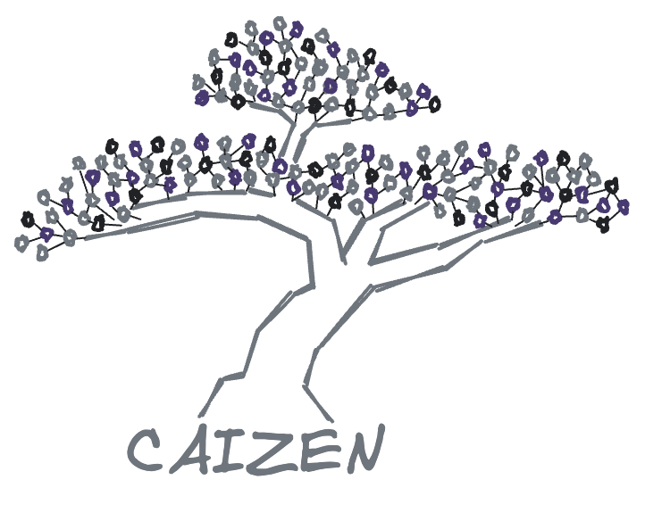
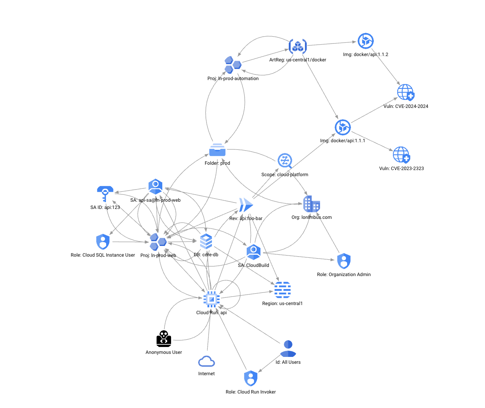
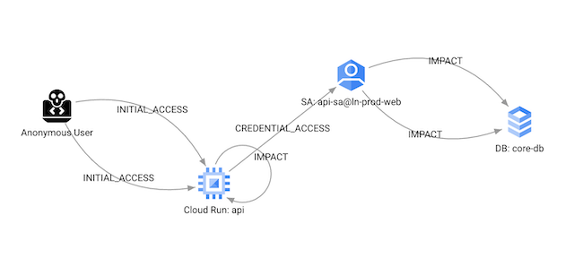
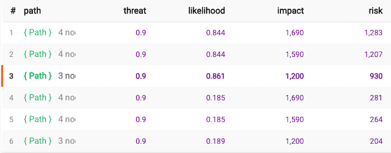

<a id="readme-top"></a>


<!-- PROJECT LOGO -->
<br />
<div align="center">
  <a href="https://github.com/caizencloud/caizen">
    
  </a>

  <h3 align="center">CAIZEN</h3>

  <p align="center">
    Harness the security superpowers of your GCP Cloud Asset Inventory.
    <br />
    <br />
    <a href="https://youtu.be/Bltr5Bn2-70">View fwd:cloudsec 2024 Talk</a>
    ·
    <a href="https://docs.google.com/presentation/d/1TotkfJIeCdl8ftN4i4OlQnZA5Hs4K-03EQoSYbWwdBc">View Talk Slides</a>
  </p>
</div>


<!-- TABLE OF CONTENTS -->
<details>
  <summary>Table of Contents</summary>
  <ol>
    <li>
      <a href="#about-the-project">About The Project</a>
      <ul>
        <li><a href="#built-with">Built With</a></li>
      </ul>
    </li>
    <li>
      <a href="#getting-started">Getting Started</a>
      <ul>
        <li><a href="#prerequisites">Prerequisites</a></li>
        <li><a href="#installation">Installation</a></li>
      </ul>
    </li>
    <li><a href="#usage">Usage</a></li>
    <li><a href="#roadmap">Roadmap</a></li>
    <li><a href="#license">License</a></li>
    <li><a href="#contributing">Contributing</a></li>
    <li><a href="#contact">Contact</a></li>
    <li><a href="#acknowledgments">Acknowledgments</a></li>
  </ol>
</details>


<!-- ABOUT THE PROJECT -->
## About The Project

If we map our cloud resources in full like this:



Then we can derive Attack Paths like this:



And score them like this:



Which enables us to measure risky combinations in our cloud configurations by modeling attacker behavior to resource goals/sub-goals using [MITRE ATT&CK® Framework](https://attack.mitre.org/) [Tactics, Techniques, and Procedures](https://attack.mitre.org/resources/) or "TTPs".

<p align="right">(<a href="#readme-top">back to top</a>)</p>


### Built With

* [Memgraph](https://memgraph.com/) - A Bolt/Neo4j compatible Graph DB running in memory
* [FastAPI](https://fastapi.tiangolo.com/) - a modern, fast (high-performance), web framework for building APIs with Python based on standard Python type hints.

<p align="right">(<a href="#readme-top">back to top</a>)</p>


<!-- GETTING STARTED -->
## Getting Started

This is an example of how you may give instructions on setting up your project locally.
To get a local copy up and running follow these simple example steps.

### Prerequisites

1. Install [Docker](https://www.docker.com/)
2. Install python 3.11+
3. Install [Poetry](https://python-poetry.org/docs/#installation)

### Installation

1. Run `poetry install` to install the dependencies
2. See the <a href="#usage">Usage</a> section for loading some data into the graph

<p align="right">(<a href="#readme-top">back to top</a>)</p>


<!-- USAGE EXAMPLES -->
## Usage

This project is currently only runnable in a demo-like fashion to showcase the potential value.

Run the following in one terminal to start the graph db container and the API:
```
make local
```

Load some sample resource data into the graph:
```
make load && make load-meta
```

Visit [localhost:3000](http://localhost:3000) to view the Memgraph UI and run some queries.

<p align="right">(<a href="#readme-top">back to top</a>)</p>


<!-- ROADMAP -->
## Roadmap

- [x] Proof of value
- [ ] Periodic ingest and parsing of all GCP CAI resources
- [ ] Real-time ingest and parsing of CAI resource updates

<p align="right">(<a href="#readme-top">back to top</a>)</p>


<!-- LICENSE -->
## License

Distributed under the Apache 2.0 License. See `LICENSE` for more information.

<p align="right">(<a href="#readme-top">back to top</a>)</p>

<!-- CONTRIBUTING -->
## Contributing

This project is not quite ready to accept external contributions.  In the meantime, feel free to contact me about your specific needs.

<p align="right">(<a href="#readme-top">back to top</a>)</p>


<!-- CONTACT -->
## Contact

Brad Geesaman - [@bradgeesaman](https://twitter.com/bradgeesaman)

Project Link: [https://github.com/caizencloud/caizen](https://github.com/caizencloud/caizen)

<p align="right">(<a href="#readme-top">back to top</a>)</p>


<!-- ACKNOWLEDGMENTS -->
## Acknowledgments

Here are a list of related resources:

* [Psychiac](https://github.com/caizencloud/psychiac) - A proof-of-concept CI companion tool for CAIZEN to perform attack path analysis before apply.
* [Google Cloud Asset Inventory](https://cloud.google.com/asset-inventory/docs/overview) - A full cloud resource inventory service.
* [MITRE ATT&CK® Framework](https://attack.mitre.org/) - A security framework for modeling attacker behaviors.
* [OpenCSPM](https://github.com/OpenCSPM/opencspm) - Prior work in this space using Ruby and RedisGraph with my coworker [joshlarsen](https://github.com/joshlarsen)
* [Cartography](https://github.com/lyft/cartography) - Original inspiration for OpenCSPM and now CAIZEN came from Cartography by Lyft. Cartography consolidates infrastructure assets and the relationships between them in an intuitive graph view.

<p align="right">(<a href="#readme-top">back to top</a>)</p>